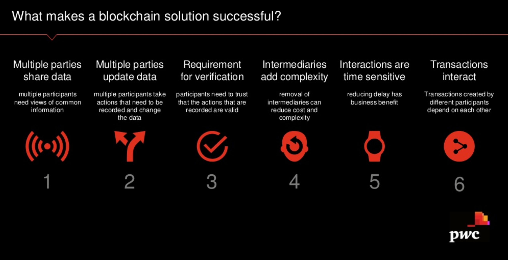
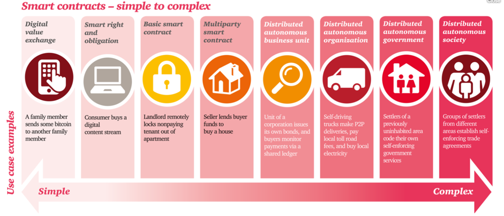

# blockchain-proto

## Notes
Distributed immutable ledger using consensus based security commonly encrypted via SHA256

Blockchain by Tiana Laurence (co-founder of Factom)
> Decentralization is seen as the perfect solution to corrupt and oppressive central authorities.

Utilize private blockchain with off-chain data storage and on-chain identity / security:
* Check-in to register a blockchain identity (gen QR code)
* Collect and encrypt data using public-key (scan QR code)
* Access and decrypt data using wallet (scan QR code)
* Contract to decrypt and use data aka Informed Consent and / or Release and Waiver
* Need symmetric-key or public-key or [homomorphic authentication](https://www.infoq.com/articles/cloud-data-auditing) for multi-party access
* Public blockchain may be needed for external contributions

[Joseph Pham via Quora](https://www.quora.com/How-will-Enterprise-Blockchain-change-the-way-future-enterprise-applications-are-architected)
> Blockchain systems could be configured to enable a securely signed, data validated and "trustless" verification protocol, that would enable source and receiving systems to create secure handover & transmission of data feeds, without exposing it to internal employees and significantly reduce the risk of outside interception, interference or exploitation.
>
> This would go beyond Service Oriented Architecture, to a Service Integrity Architecture, whereby all system data and process integrity would be designed with auditability, traceability and transparency by default, and only involve external parties, when handling exceptions.
>
> The main capabilities that would enable this design are keyless signature infrastructure (KSI) and process verification / auditability, which can be configured as smart contracts between applications.

[Proof-of-Authority-Chains](https://github.com/paritytech/parity/wiki/Proof-of-Authority-Chains) are used for private chain setups, where specific nodes are authorized to create new blocks and secure the network.

## References
* [List of Dapps](https://dapps.ethercasts.com/)
* [Factom](https://www.factom.com/) - Blockchain for the Enterprise
  * [Factom Open Source](https://github.com/FactomProject/factomd)
  * [dLoc](https://www.factom.com/products/dloc) - dLoc is a document authentication and verification that reliably authenticates any essential documents, including birth certificates, land titles, and medical records.
* [DigiByte](https://digibyte.co/) - Gaming "bitcoins"
  * [DigiByte Gaming Hub](http://www.digibytegaminghub.com/) - earn by playing lol, wow, cs
* [Hyperledger](https://www.hyperledger.org/)
  * [Fabric](http://hyperledger-fabric.readthedocs.io/en/latest/prereqs.html)
* [BlockApps](http://blockapps.net/) - Blockchain Platform on AWS
  * [BlockApps for Developers](http://developers.blockapps.net/) - guides show demos of UI and APIs
* [Rubix by Deloitte](http://rubixbydeloitte.com/) - Advise and Build solutions
* [Parity](https://github.com/paritytech/parity) - Fast, light, robust Ethereum implementation via Rust
* [Corda](https://github.com/corda/corda) - Private Permission network
* [Quorum](https://github.com/jpmorganchase/quorum) - Private Permission network

## Technology Explored
* [Ethereum Wallet](https://www.ethereum.org/)
  * [Solidity](https://solidity.readthedocs.io/en/develop/index.html) - language for contracts
  * [Create Cryptocurrency](https://www.ethereum.org/token)
  * [Create Crowdsale](https://www.ethereum.org/crowdsale)
  * [Create Org](https://www.ethereum.org/dao)

* [Atom](https://atom.io/) - Editor
  * [Etheratom](https://github.com/0mkara/etheratom) - Plugin for syntax highlighting, compilation and a runtime environment (Backend node & VM compatible)
  * [Solidity](https://atom.io/packages/linter-solidity) - Linter for .sol files

* [Go-Ethereum](https://github.com/ethereum/go-ethereum/) - Go implementation of Ethereum (other options are C++ and Python)

## Tutorials
* [How to Setup Private Ethereum Blockchain](https://medium.com/blockchain-education-network/use-geth-to-setup-your-own-private-ethereum-blockchain-86f1200e6d40)
* [How to Build a Private Ethereum Blockchain](https://media.consensys.net/how-to-build-a-private-ethereum-blockchain-fbf3904f337)
